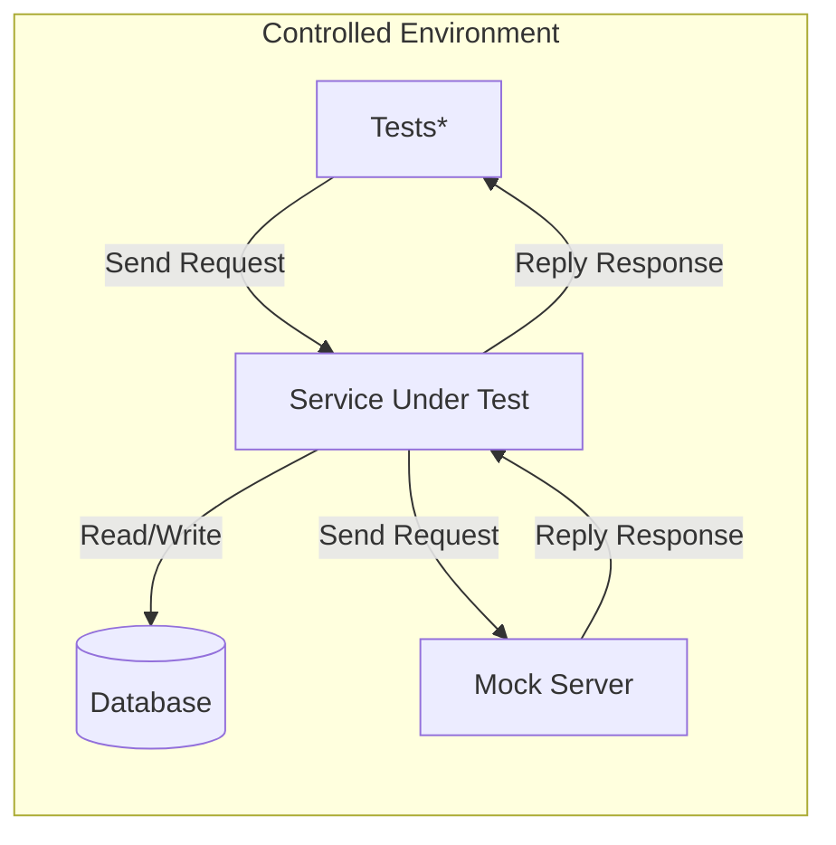

# Component Testing

Testing is performed on each component independently without integrating with other components.

```mermaid
graph LR;
    subgraph Controlled Environment
    p[Tests*]
    sut[Service Under Test]
    ms[Mock Server]
    db[(Database)]

    p-- Send Request -->sut
    sut-- Read/Write -->db
    sut-- Send Request -->ms
    ms-- Reply Response -->sut
    sut-- Reply Response -->p
    end
```