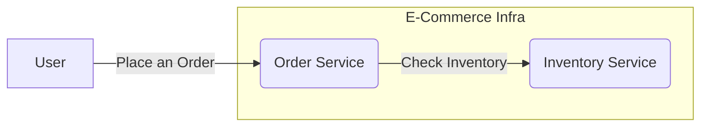

# Component Testing - Example

Assume an e-commerce application that is built on micro-services architecture.

<v-clicks>

### Endpoints

- **POST** - /api/order-service/v1/orders

- **GET** - /api/inventory-service/v1/products

</v-clicks>