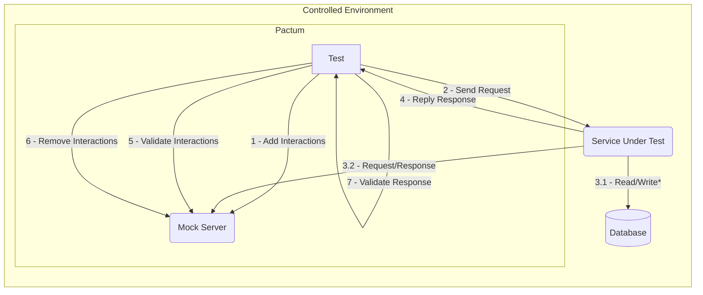

# Component Testing - Pattern

Component Testing pattern in pactum.

```mermaid
graph LR;
    subgraph Controlled Environment

    subgraph Pactum
        t[Test]
        ms(Mock Server)
        
    end

    sut(Service Under Test)
    db[(Database)]
    

    t-- 1 - Add Interactions -->ms
    t-- 2 - Send Request -->sut
    sut-- 3.1 - Read/Write* -->db
    sut-- 3.2 - Request/Response -->ms
    sut-- 4 - Reply Response -->t
    t-- 5 - Validate Interactions -->ms
    t-- 6 - Remove Interactions -->ms
    t-- 7 - Validate Response -->t
    end
```