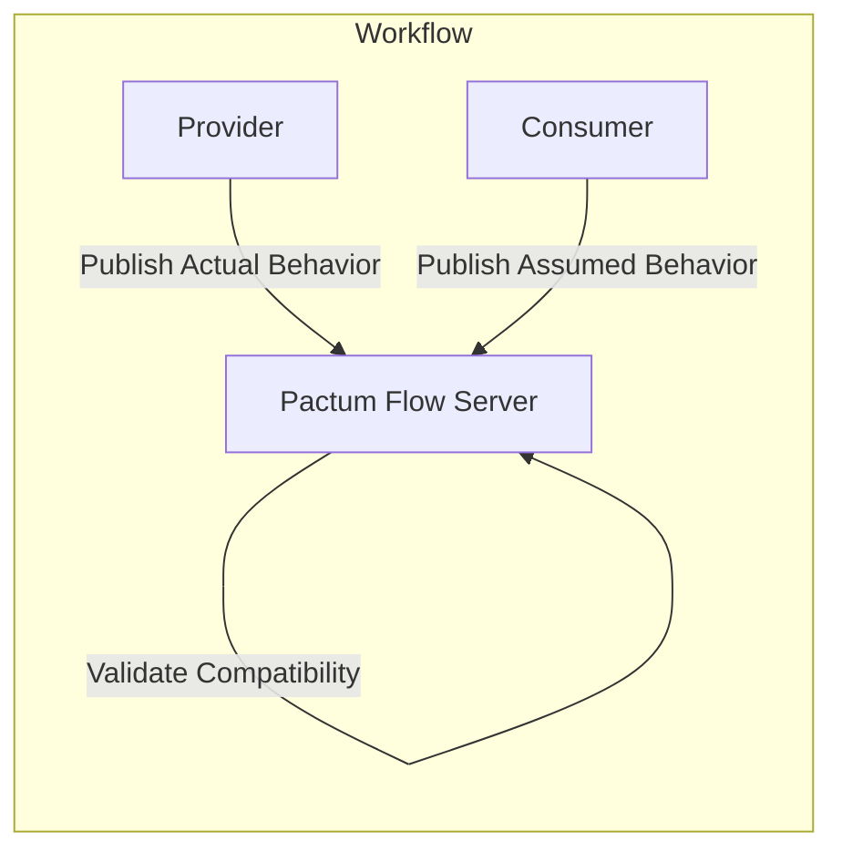

# Contract Testing - Pattern

Pactum is a mix of **consumer-driven** & **provider-driven** contract testing.

### Steps

<v-clicks>

1. Publish Actual Behavior (_By Provider_)
2. Publish Assumed Behavior (_From Consumer_)

</v-clicks>

<v-clicks>

</v-clicks>