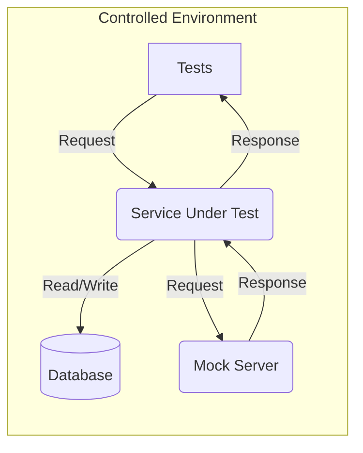
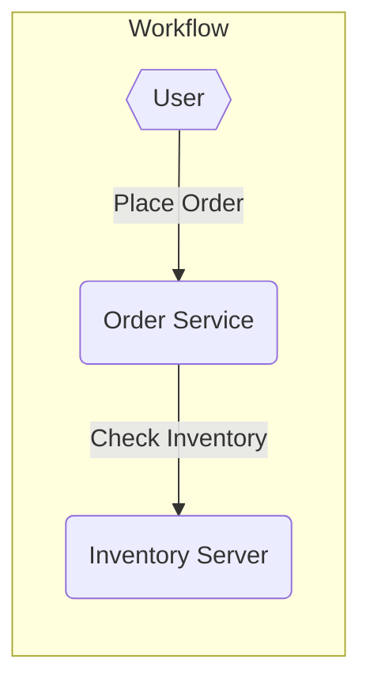

---
layout: center
---

# what is <span class="text-yellow-300">pactum</span><mdi-map-marker-question class="inline text-yellow-300" />

<v-clicks>

An **open-source** library for testing RESTful APIs written in **javascript** for all levels in a **Testing Pyramid**.

</v-clicks>

---
layout: center
---

# <mdi-download class="text-center text-blue-500" /> setup & installation

<v-clicks>

```shell
npm install pactum <test-runner>
```

</v-clicks>

---
layout: center
---

# <span class="text-center text-green-600" > clear & comprehensive </span>

---
layout: center
---

<mdi-api class="text-3xl text-blue-500" />

```js
await spec().<command>().<command>()       
```

---

# simple test

a simple test case using **PactumJS** and **mocha**.

<br />
<br />
<br />

<v-clicks>

```js {0|1|3,7|4|5|6|all}
const { spec } = require('pactum');

it('should be a teapot', async () => {
  await spec()
    .get('http://httpbin.org/status/418')
    .expectStatus(418);
});
```

</v-clicks>

---

# advanced test

<br />
<br />
<br />

<v-clicks>

```js {0|1,2|4,13|6|7-10|11|12|all}
const { spec } = require('pactum');
const { like } = require('pactum-matchers');

it('should create a new user', async () => {
  await spec()
    .post('https://reqres.in/api/users')
    .withJson({
      "name": "morpheus",
      "job": "leader"
    })
    .expectStatus(201)
    .expectJsonMatch('id', like("1"));
});
```

</v-clicks>

---
layout: center
---

# data management

<v-clicks>

- templates
- maps
- functions
- stores

</v-clicks>

---

# adding a data template

<br />
<br />

```js
const { stash } = require('pactum');

stash.addDataTemplate({
  'USER_DTO': {
    "name": "morpheus",
    "job": "leader"
  }
});
```

---

# using a data template

<br />

```js
await spec()
  .post('https://reqres.in/api/users')
  .withJson({
    "@DATA:TEMPLATE@": "USER_DTO"
  });
```

<br />
<br />

```js
await spec()
  .post('https://reqres.in/api/users')
  .withJson({
    '@DATA:TEMPLATE@': 'User',
    '@OVERRIDES@': {
      'job': 'member'
    }
  });
```

---
layout: center
---

# handlers

<v-clicks>

- spec
- expect
- interaction

</v-clicks>

---

# adding a spec handler

<br />
<br />

```js
const { handler } = require('pactum');

handler.addSpecHandler('get random users', (ctx) => {
  const { spec, data } = ctx;
  spec.get('https://randomuser.me/api');
  spec.withQueryParams('results', data);
  spec.expectStatus(200);
});
```

---

# using a spec handler

<br />
<br />

```js
await spec('get random users', 2)
  .expectJsonLike({
    "results": "$V.length === 2"
  });
```

<br />

```js
await spec('get random users', 3)
  .expectJsonLike({
    "results": "$V.length === 3"
  });
```

---
layout: center
---

# integration testing

---

# stores

<br />

```js
const { spec } = require('pactum');

it('should return all posts and first post should have comments', async () => {
  await spec()
    .get('http://jsonplaceholder.typicode.com/posts')
    .expectStatus(200)
    .stores('FirstPostId', '[0].id');
  
  await spec()
    .get(`http://jsonplaceholder.typicode.com/posts/{id}/comments`)
    .withPathParams('id', '$S{FirstPostId}')
    .expectStatus(200);
});
```

---
layout: center
---

# mock server

---

# adding an interaction

interactions will help to simulate the HTTP requests & responses

<br />

<v-clicks>

```js {all|1,14|3,12|4,7,8,11|4-7|8-11|all}
const { mock } = require('pactum');

mock.addInteraction({
  request: {
    method: 'GET',
    path: '/api/hello'
  },
  response: {
    status: 200,
    body: 'Hello, 👋'
  }
});

mock.start(3000);
```

</v-clicks>

---
layout: center
---

# component testing

---
layout: fact
---



---
layout: fact
---



---

## component tests

<br />

```js
it('should buy a product which is in-stock', async () => {
  await pactum.spec()
    .useInteraction('get in-stock product from inventory-service')
    .post('/api/order-service/v1/orders')
    .withJson({
      "product": "iPhone"
    })
    .expectStatus(200);
});
```

<br />

```js
it('should not buy a product which is out-of-stock', async () => {
  await pactum.spec()
    .useInteraction('get out-of-stock product from inventory-service')
    .post('/api/order-service/v1/orders')
    .withJson({
      "product": "iPhone"
    })
    .expectStatus(400);
});
```

---
layout: center
class: text-center
---

# Learn More

[<mdi-book-open /> Documentation](https://pactumjs.github.io) · [<mdi-github /> GitHub](https://github.com/pactumjs/pactum)